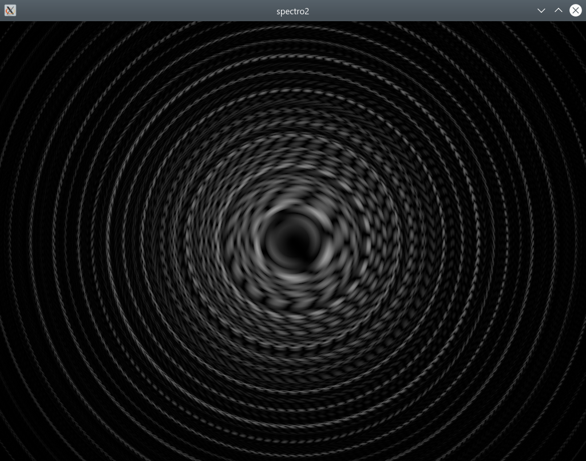

# spectro2

spectro2 is an in-development audio spectrum visualizer which shows precise pitches, and visualizes phase as well as amplitude.

spectro2 is written in Rust, performs frequency-domain analysis (FFT) on the CPU, and renders an image on the GPU using wgpu.

A help file is available at [help/index.md](help/index.md).

Screenshot from [Pokémon Mystery Dungeon 2 - Dialga's Fight To the Finish! (MIDI rip)](https://www.youtube.com/watch?v=ytLzeQNiJDs):

## Download

Pre-built Windows and Linux (untested) development binaries are available from [GitHub Actions](https://github.com/nyanpasu64/spectro2/actions), which requires logging into GitHub. If you are not logged in, you can download binaries through [nightly.link](https://nightly.link/nyanpasu64/spectro2/workflows/rust/master) (which creates temporary direct links to GitHub Actions binaries).

## Building

Clone the repo and run `cargo run`. `cargo run --release` will not generate debug info, and may or may not produce a slightly faster binary.

Building the software also requires CMake, Git, Python 3, a C++ compiler, and (on Windows) Ninja, in order to build the Vulkan SDK.

Note that this project has custom flags for debug and release builds. Dependencies like the FFT algorithm are compiled in `-O2` in both debug and release mode; only this crate has optimization disabled in debug mode. See `.cargo/config.toml` for details.

## Usage

If you clone the Git repository, spectro2 can be run using `cargo run`. If you type `cargo run [...] --`, all arguments after the double-hyphen are passed to `spectro2` instead of `cargo run`.

If you download binaries, you can instead run `spectro2` directly.

**SEIZURE WARNING:** Rapidly changing audio can cause flashing lights, especially once colored stereo is added.

For more information, see the help file at [help/index.md](help/index.md).

### Testing `flip-cell`

The `flip-cell` crate is shipped in this repository. It is tested using Loom and Miri to check for undefined behavior in unsafe code.

If you use VSCode with CodeLLDB extension, the bundled launch.json will allow you to run a subset of `flip-cell`'s unit tests in Loom, to check for concurrency/ordering bugs. I have not created a configuration for Miri yet.

If you are not using VSCode, you can launch the tests using the following:

- Loom: `cargo test -p flip-cell --features loom`
- Miri: `cargo +nightly miri test --target-dir miri -p flip-cell` (Miri cannot use the same target directory as your regular builds)

## Design docs

There are (internal, disorganized) design documents (planning and notes) at https://drive.google.com/drive/folders/1Jzo9SQ8yuVD9YK7dTZaC7mlJmPSnHnZy?usp=sharing.

## Credits

This program would not be possible without the assistance of:

- The Rust Community Discord, #games-and-graphics
- https://sotrh.github.io/learn-wgpu/
