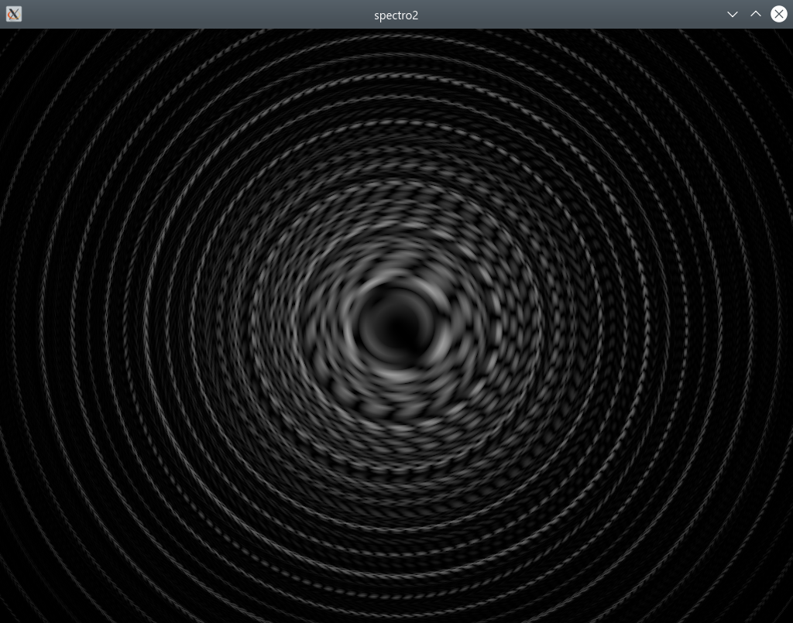

# spectro2 help

spectro2 is an in-development audio spectrum visualizer which shows precise pitches, and visualizes phase as well as amplitude.

spectro2 is written in Rust, performs frequency-domain analysis (FFT) on the CPU, and renders an image on the GPU using wgpu.

Screenshot from [Pokémon Mystery Dungeon 2 - Dialga's Fight To the Finish! (MIDI rip)](https://www.youtube.com/watch?v=ytLzeQNiJDs):



To change program options, you need to pass command-line arguments. spectro2 currently does not have a config file or a GUI.

## Basic setup

You will most likely want to visualize audio playing from speakers, rather than entering the microphone. On Windows, this can be accomplished through `spectro2 --loopback`.

On Linux with PulseAudio, you need to specify the sampling rate (and channel count) manually, for example: `spectro2 --sample-rate 48000 --channels 2` . Additionally, `--loopback` does not work (because spectro2 talks to PulseAudio through the ALSA API); instead you need to open pavucontrol to enable loopback capture ([instructions here](https://wiki.ubuntu.com/record_system_sound#Audio_Loopback_Recording_With_PulseAudio)).

spectro2 is not tested on Macs, so I don't know how to set it up there.

**SEIZURE WARNING:** Rapidly changing audio can cause flashing lights, especially once colored stereo is added.

## List of options

Full list of command-line arguments: `spectro2 --help` (`-h` will only print short help).

```
USAGE:
    spectro2.exe [FLAGS] [OPTIONS]

OPTIONS:
    -D, --show-devices
            If passed, prints a list of audio devices, and stream modes for the chosen device

    -d, --device-index <device-index>
            If passed, will override which device is selected.

            This overrides --loopback for picking devices. However, you still need to pass --loopback if you pass an
            output device (speaker) to --device-index.
    -s, --sample-rate <sample-rate>
            Override the default sampling rate of the audio device.

            If not passed, on Linux PulseAudio setups, spectro2 opens the input device at 384000 Hz and not the actual
            PulseAudio sampling rate.
    -c, --channels <channels>
            Override the default channel count of the audio device.

            If not passed, on Linux PulseAudio setups, spectro2 opens the input device with 1 channel and not the actual
            PulseAudio channel count.
    -l, --loopback
            If passed, will listen to output device (speaker) instead of input (microphone).

            Primarily intended for Windows WASAPI. Does not work on Linux PulseAudio; instead use pavucontrol to switch
            the audio input to speaker loopback.
    -v, --volume <volume>
            How much to amplify the incoming signal before sending it to the spectrum viewer [default: 20]

    -f, --fft-size <fft-size>
            Number of samples to use in each FFT block.

            Increasing this value makes it easier to identify pitches, but increases audio latency and smearing in time.
            Must be a multiple of --redraw-size. [default: 2048]
    -r, --redraw-size <redraw-size>
            Number of samples to advance time before recalculating FFT.

            Decreasing this value causes FFTs to be computed more often, increasing CPU usage but reducing latency and
            stuttering.

            If this value exceeds --fft-size, it is clamped to it. Otherwise must be a factor of --fft-size. [default:
            512]
        --fps <fps>
            Limit the FPS of the rendering thread.

            If set to 0, FPS is unbounded and this program will max out the CPU and/or GPU.

            This program does not support vsync because it adds around 3 frames of latency. [default: 200]
        --print-fps
            If passed, prints FPS to the terminal

    -h, --help
            Prints help information

    -V, --version
            Prints version information
```

Note that loopback mode has somewhat higher latency than microphone input, to the point it can distract from listening to music. I'm not familiar with latency compensation, and if anyone has suggestions, feel free to let me know. My best attempt so far is to route your music player through VB-Audio Virtual Cable's input, use `--device-index` to visualize it, and configure Windows to listen to the output. This will delay audio by more than the video latency, which may be worse than not using it.

## Usage overview

spectro2 is quite math-heavy, to the point even I don't fully understand why it works. I tried documenting and analyzing its behavior in detail, in a [Google doc](https://docs.google.com/document/d/1VexTdd1ea_KjvInykhxxyDuwXhSR_kpzonaKZ-HK96U).

The incoming audio is split into frequencies using the Fourier transform. Lower frequencies are plotted in the center of the circle, and higher frequencies towards the outside. Increasing the FFT size (`--fft-size`) makes it easier to identify pitches, but increases audio latency and smearing in time.

Because the input is windowed, each sine wave is spread out to around 3 frequency bands, which are in-phase at the right of the circle and out-of-phase at the left.

The frequency scaling is configurable by editing the shader at "shaders/shader.frag". The current default is "radius = sqrt(frequency)", but this is subject to change.

A constant tone is represented as one ring per harmonic, with a stable rotation. As each harmonic rises in pitch, the ring rotates clockwise and expands.

Low bass notes with harmonics cause the rings to "point" in a specific direction. There is one "pointer" per peak in the signal's fundamental, and both are only in-phase on the right of the plot. As the fundamental increases in frequency, the fundamental rotates clockwise, expands, and grows more peaks, resulting in multiple "pointers" appearing. Eventually the pattern becomes indistinct.

Pianos have some degree of inharmonicity (higher overtones are sharp relative to lower/fundamental), so low piano notes will have their upper overtones "pointing" further clockwise than the fundamental and lower overtones.

Solo instruments tend to have narrow sharp rings with stable rotation. Chorused/ensemble instruments and string pads tend to have wider bands which "swim" around and randomly change amplitude and rotation. Unpitched noise and percussion tends to produce messy wide bands of light, which flicker constantly and obscure other instruments.

Simpler songs tend to be easier to visualize. Soloing instruments can produce interesting visualiations obscured when other instruments are added. Reverb tends to smear instruments in time and interfere with phase relationships, making it harder to follow pitches.

Try looking into the center of the circle (lowest frequencies), and using your peripheral vision to watch the moving contours of the outer rings.

## Recommended listening

- Tabla drums (https://www.youtube.com/watch?v=r31oe7Sm0vI)
- Human voices
- Soloed synthesizer notes
